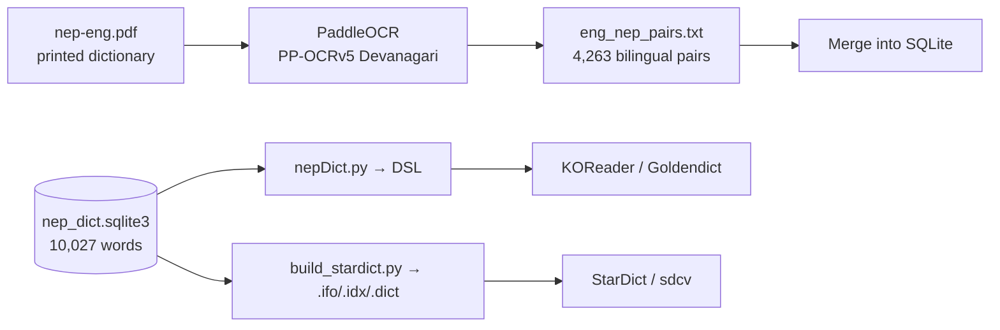

# Nepali Dictionary

Extract Devanagari text from legacy-font Nepali PDFs via PaddleOCR, then build a bilingual English-Nepali dictionary for KOReader, Goldendict, and `sdcv`.

## Dictionary

| Metric | Count |
|--------|-------|
| Headwords | 10,027 |
| Definitions | 14,301 |
| Usage examples | 16,115 |
| English-Nepali pairs | 4,263 |

### Sources

- **Nepali definitions**: [nepali_dictionary](https://github.com/anuragregmi/nepali_dictionary) by Anurag Regmi — 7,620 words with Nepali definitions and usage examples
- **English translations**: [Nepali-English Dictionary](https://languages.nepalresearch.org/nep-eng.pdf) by Karl-Heinz Krämer — 4,263 bilingual pairs extracted via the OCR pipeline

### Known issues

- Some garbage entries may still exist from OCR extraction — if you find one, note the word and it can be cleaned from the DB
- 57% of bilingual pairs don't match existing DB headwords due to OCR spelling diffs, multi-word phrases, and genuinely new vocabulary
- PP-OCRv5 Devanagari model has ~85-90% accuracy on legacy-font Nepali; known error patterns: ब/व confusion, missing anusvara, conjunct simplification

## Quick Start — Lookup

```bash
STARDICT_DATA_DIR="dictionary-data" sdcv "अभाव"
```

```bash
abhav n. non-existence, absence, lack, scarcity
कुनै कुरा आवश्यक मात्रामा नभएको वा कत्ति पनि नभएको अवस्था
```

### Install `sdcv`

```bash
sudo apt install sdcv
```

Add to `~/.bashrc` for convenience:

```bash
export STARDICT_DATA_DIR="$HOME/github/translation/dictionary-data"
```

### KOReader

Copy the three StarDict files into KOReader's `dict/` directory:

| File | Size |
|------|------|
| `dictionary-data/nepali_dictionary.ifo` | 223 B |
| `dictionary-data/nepali_dictionary.idx` | 270 KB |
| `dictionary-data/nepali_dictionary.dict` | 1.3 MB |

Paths by device:
- **Kobo**: `.adds/koreader/data/dict/`
- **Kindle (jailbroken)**: `koreader/data/dict/`
- **PocketBook**: `system/share/koreader/data/dict/`

Restart KOReader. The dictionary appears in the lookup menu automatically.

A pre-packaged tarball is at `dictionary-data/koreader-nepali-dict.tar.gz`.

## Pipeline



### Scripts

| Script | What it does |
|--------|-------------|
| `extract_pairs.py` | OCR `nep-eng.pdf` column-aware, saves bilingual pairs |
| `nepDict.py` | Convert SQLite → DSL format for KOReader/Goldendict |
| `build_stardict.py` | Convert SQLite → StarDict format for `sdcv` |
| `merge_pairs.py` | Merge bilingual pairs into SQLite database |

## File Layout

```
dictionary/                  Tracked — scripts and text data
├── README.md
├── AGENTS.md
├── extract_pairs.py         OCR → bilingual pairs
├── nepDict.py               SQLite → DSL converter
├── build_stardict.py        SQLite → StarDict converter
├── merge_pairs.py           Merge bilingual data into DB
├── eng_nep_pairs.txt        4,263 English-Nepali pairs
└── ...

dictionary-data/             Gitignored — large binaries
├── nep_dict.sqlite3         Main dictionary DB (10,027 words)
├── nepali_dictionary.dsl         DSL format
├── nepali_dictionary.{ifo,idx,dict}  StarDict files
├── nep-eng.pdf                   Source PDF (148 pages)
└── koreader-nepali-dict.tar.gz   Pre-packaged bundle
```

## Acknowledgements

- [nepali_dictionary](https://github.com/anuragregmi/nepali_dictionary) by Anurag Regmi — the core Nepali-Nepali dictionary database
- [Nepali-English Dictionary](https://languages.nepalresearch.org/nep-eng.pdf) by Karl-Heinz Krämer — source of the bilingual pairs
- [PaddleOCR](https://github.com/PaddlePaddle/PaddleOCR) — the Devanagari OCR model (PP-OCRv5)
- KOReader, Goldendict, and StarDict — the dictionary ecosystems that make this useful

## License

MIT
